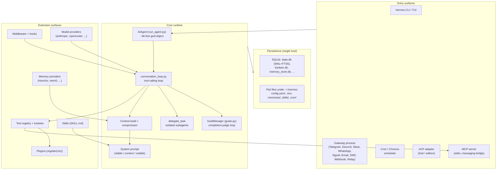
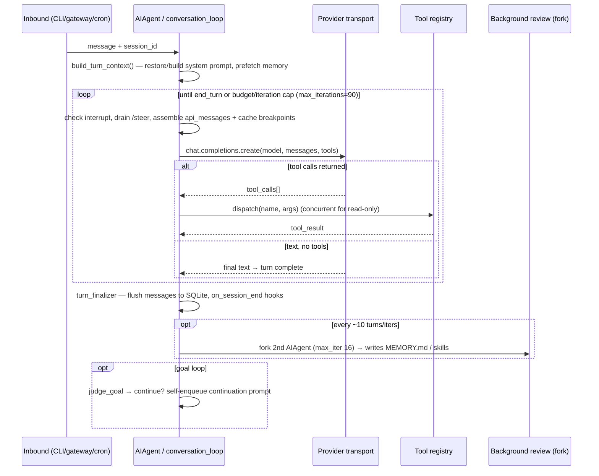
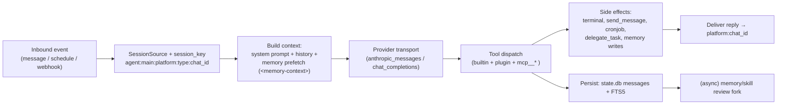
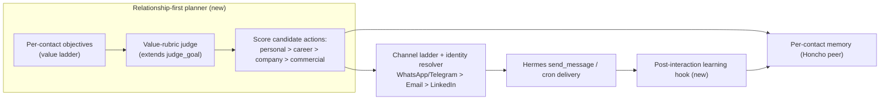
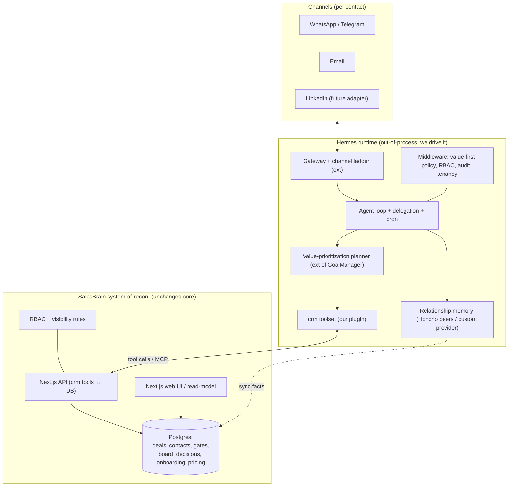
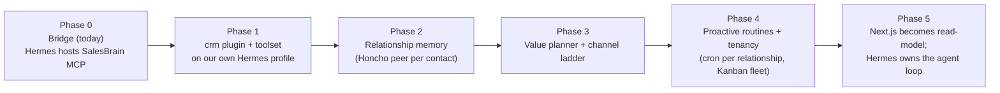

# SalesBrain on Hermes — Architecture Evaluation & Integration Strategy

> **Status:** Research & architecture discovery (Milestone 1). No implementation.
> **Date:** 2026-07-22
> **Basis:** Direct source inspection of `NousResearch/hermes-agent` **v0.19.0** (MIT), cloned in full (7,012 files, ~240 MB) and analyzed subsystem-by-subsystem, cross-referenced against the current SalesBrain codebase (`docs/architecture.md`, `db/schema.sql`, `lib/*`).
> **Author:** Architecture analysis for the SalesBrain → relationship-first evolution.

---

## 0. Executive summary & headline recommendation

Hermes is a **genuinely strong agent _runtime_** — its conversation loop, subagent delegation, cron/scheduling, multi-channel gateway, pluggable memory-provider abstraction, skills system, and (critically) an explicit **plugin governance model that welcomes exactly the kind of domain app we want to build** are all real, well-factored, and mostly extensible without touching core.

It is **not** a slim embeddable library, and it is **not** a system-of-record. It is a ~large full application whose state lives in **single-host SQLite + flat files under `~/.hermes`**, whose central `AIAgent` is a ~6,000-line god-object with no service boundary, whose built-in memory is **unstructured markdown for a single user**, and whose planner is a **binary "is the goal done?" judge**, not a value-maximizer. None of SalesBrain's crown jewels — the Postgres relational model, RBAC/visibility rules, the board-vote state machine, the web UI — fit _inside_ Hermes.

**Recommendation (in one line):** **Adopt Hermes as the agent runtime and relationship/communication layer — packaged as a standalone Hermes _plugin constellation_ — while keeping SalesBrain's Postgres as the system-of-record and the Next.js app as the human UI. Do not fork Hermes, and do not rebuild SalesBrain inside it.**

This is deliberately **not** a wholesale "port SalesBrain into Hermes" endorsement. The user brief said _"do not assume Hermes is the correct solution."_ The evidence says: Hermes-as-runtime — **yes**; Hermes-as-monolithic-rewrite-target — **no**. The value-prioritization planner and the cross-channel contact model are **new builds** layered on Hermes primitives, not things Hermes gives us for free.

| Question | Verdict |
|---|---|
| Can Hermes be the core agent runtime? | **Yes** — as an out-of-process runtime we drive, not a library we embed. |
| Rebuild SalesBrain's data/UI inside Hermes? | **No** — Postgres + Next.js stay; Hermes never becomes the system-of-record. |
| Fork Hermes? | **No** — maintainers forbid plugins touching core and want domain code as standalone plugins. Fork = high maintenance vs a fast-moving, exact-pinned, 750 KB-file tree. |
| Contribute upstream? | **Selectively** — only genuinely-generic seams (a value-rubric goal-judge hook, a cross-channel identity interface). Domain logic ships as our own plugin repo. |
| Biggest new builds | **(1)** value-prioritization planner, **(2)** cross-channel contact identity + channel-preference ladder, **(3)** relational CRM store exposed as a `crm` toolset. |

---

## 1. Scope & method

We treated "understand Hermes" as a source-truth exercise, not a docs-reading one (the docs drift from the code in several places — noted inline). We:

1. Cloned `NousResearch/hermes-agent` at **v0.19.0** in full.
2. Ran **six parallel source-inspection passes**, one per subsystem cluster: core runtime/loop; planner/reflection; memory/user-modeling; skills/plugins/tools; MCP/providers/storage; gateway/events/scheduling — each reading real files and reporting `file:line` evidence.
3. Cross-read the authoritative internal guide `AGENTS.md` (75 KB) and the `docs/` design notes (`session-lifecycle.md`, `profile-builder.md`, `profile-routing.md`, `middleware/README.md`, `chronos-managed-cron-contract.md`, `relay-connector-contract.md`).
4. Cross-referenced against SalesBrain's own architecture doc and schema.

Where the README and the code disagree, the code wins in this report (e.g. the README claims "FTS5 session search **with LLM summarization**"; the summarization path was explicitly removed — `tools/session_search_tool.py:20-29`).

---

## 2. What Hermes is

- **Origin/licence:** Built by **Nous Research**, **MIT**, self-hosted, "zero telemetry." Python **3.11**, managed by `uv`. Descends from a predecessor ("OpenClaw") and carries a Claude-Code-like memory/skill lineage (`SOUL.md` / `MEMORY.md` / `USER.md` / `AGENTS.md`, `SKILL.md`).
- **What it's _for_:** a **persistent, self-improving personal agent** — it runs unattended on a cheap VPS or serverless backend, reachable from Telegram/Discord/Slack/WhatsApp/Signal/CLI, that accrues memory and skills over time.
- **Shape:** a **full application**, not a framework. Two console entry points (`pyproject.toml:312-314`): `hermes` (CLI/gateway/cron front-end → `hermes_cli.main:main`) and `hermes-agent` (`run_agent:main`).
- **Scale/coupling signal:** `run_agent.py` ~302 KB (~6 k LOC `AIAgent`), `cli.py` ~751 KB (~11 k LOC), `hermes_state.py` ~393 KB, plus module dirs `agent/` (158 files), `hermes_cli/` (210), `plugins/` (188), `tools/` (114), `gateway/` (77), `skills/` (67). ~17 k tests.
- **Dependency posture:** every direct dep is **exact-pinned** (hardened after a May 2026 PyPI supply-chain worm). Upgrades are intentional, and any fork inherits that churn.

---

## 3. How Hermes works internally

### 3.1 High-level architecture

### 3.2 Runtime lifecycle & the agent loop

An agent run is **synchronous, thread-based** (not an async service). `AIAgent.run_conversation` (`run_agent.py:6382`) is a thin forwarder to the real loop in `agent/conversation_loop.py:run_conversation` (`:589`). Per-turn setup (sanitization, nudge-counter hydration, system-prompt build/restore, preflight compression, `pre_llm_call` hook, memory prefetch) is factored into `build_turn_context` (`agent/turn_context.py:287`).

Key facts: loop bounded by **both** `max_iterations` (default **90**, shared with subagents) and an `IterationBudget` with a one-call grace escape (`conversation_loop.py:724`). Streaming is first-class with single-writer arbitration. Live per-turn state (the `messages` list, counters, cached prompt) lives **in memory on the `AIAgent` instance**; it is flushed to SQLite via `_flush_messages_to_session_db` (`run_agent.py:1826`). Messages are OpenAI-shaped (`{role: system|user|assistant|tool}`).

### 3.3 Module breakdown

| Module / file | Responsibility |
|---|---|
| `run_agent.py` | `AIAgent` god-object: loop entry, tool dispatch, streaming, persistence flush, background-review spawn (~240 methods). |
| `agent/conversation_loop.py` | The actual tool-calling loop (~5.8 k lines): iteration control, retries, tool dispatch, stream deltas. |
| `agent/agent_init.py` | `initialize_agent()` — ~60-param constructor; nudge intervals, budgets. |
| `agent/turn_context.py` / `turn_finalizer.py` | Per-turn setup and teardown; nudge counters; `on_session_end`. |
| `agent/system_prompt.py` / `prompt_builder.py` / `prompt_caching.py` | 3-tier prompt assembly + Anthropic cache-control breakpoints. |
| `agent/context_engine.py` / `context_compressor.py` | Pluggable compression ABC + default compressor. |
| `hermes_cli/goals.py` | `GoalContract` / `GoalState` / `GoalManager` + `judge_goal` (completion-judge planner). |
| `tools/delegate_tool.py` / `async_delegation.py` | Subagent spawn (sync/background, leaf/orchestrator), durable async delegation. |
| `agent/curator.py` / `background_review.py` | Skill-library gardener (7-day) + per-turn memory/skill review fork. |
| `agent/memory_manager.py` / `memory_provider.py` / `tools/memory_tool.py` | Memory orchestration; `MemoryProvider` ABC; built-in `MEMORY.md`/`USER.md` store. |
| `hermes_state.py` | `SessionDB`/`AsyncSessionDB` over SQLite (WAL, FTS5); sessions/messages/usage/delegations. |
| `tools/registry.py` / `toolsets.py` / `model_tools.py` | Global tool registry, toolset groups, discovery + LLM schema emission. |
| `tools/mcp_tool.py` | Full MCP **host** (stdio/HTTP/SSE); merges remote tools as `mcp__<server>__<tool>`. |
| `mcp_serve.py` | Hermes-as-MCP-**server** (stdio; 10 messaging tools). |
| `providers/` + `plugins/model-providers/` + `agent/transports/` | Two-layer provider abstraction (`ProviderProfile` + `ProviderTransport`). |
| `gateway/` | Multi-platform messaging: `BasePlatformAdapter`, `MessageEvent`, session routing, delivery. |
| `cron/jobs.py` + `scheduler.py` | Scheduler (durations/cron/ISO), per-job model/skills/script/delivery. |
| `plugins/` | Plugin system: general (`register(ctx)`), memory, model-provider, context-engine, kanban, observability. |
| `hermes_cli/` | 210-file CLI: subcommands, setup wizard, plugin loader, skin engine, kanban CLI. |

### 3.4 Data flow (inbound → action → persistence)

---

## 4. Subsystem deep-dives

### 4.1 Planner & goals
- **Explicit but backward-checking.** `hermes_cli/goals.py`: `GoalContract` (`:299`, fields `outcome/verification/constraints/boundaries/stop_when`), `GoalManager` (`:1079`), and `judge_goal` (`:846`) — a **separate aux-LLM** returning `done|continue|wait|skipped`. After each turn `evaluate_after_turn` runs; on `continue` it synthesizes a continuation prompt and **self-enqueues** it (`cli.py:9737-9752`).
- **No forward task-graph planner in the core loop.** Goal decomposition exists **only in Kanban** (`hermes_cli/kanban_decompose.py:271`, aux-LLM "kanban_decomposer" fans a task into a child graph with role assignments).
- **Implication:** the judge is a **pluggable, config-routed aux-LLM** call — so a value-prioritization judge is an _extension point_, not a rewrite.

### 4.2 Delegation & orchestration (the real orchestration layer)
- `tools/delegate_task` (`tools/delegate_tool.py:2426`): spawns **isolated** child agents with purpose-built prompts (no parent history leaks in); returns a budget-capped summary. **Single** or **batch/parallel** (`tasks:[...]`, concurrency default 3). Roles **`leaf`** (default; can't re-delegate/memory/send) vs **`orchestrator`** (can spawn, depth ≤ 2). **Background/durable** via `async_delegation.py` (thread pool + SQLite persistence + crash recovery).
- **Agent-invoked, not a standing planner** — the LLM decides to call it.

### 4.3 Reflection / self-improvement
- **Two turn-based nudges** (default every **10** turns/iters): a **memory review** and a **skill review**, each forking a full second `AIAgent` (`background_review.py`, `max_iterations=16`, `skip_memory=True`) that writes `MEMORY.md`/skills through the normal tools.
- **Curator** (`agent/curator.py`): a **background skill-library gardener** on a **7-day** interval — archives/prunes/consolidates stale _agent-created_ skills; never deletes; pinned skills exempt. It **maintains** skills; it does **not** create them from task outcomes.
- **Gap for us:** there is **no per-interaction "what did I learn about this _person_" hook** — the memory guidance even discourages storing per-event facts. That hook is a new build.

### 4.4 Memory & user modeling  ← _most strategically important subsystem_
- **Built-in store** (`tools/memory_tool.py`): `~/.hermes/memories/MEMORY.md` (agent notes) + `USER.md` (the _one_ user), `§`-delimited, **character-capped** (2200 / 1375), written atomically under a lock with drift detection. A **frozen snapshot** is injected into the system prompt at session start; mid-session writes hit disk but don't change the prompt (preserves cache). **Whole-file, not semantic, single-user.**
- **Multi-person modeling = Honcho** (`plugins/memory/honcho/`, off by default): model is **workspace → peers → sessions**. Each **peer** carries a **representation**, a **peer card** (curated facts), and **conclusions**; `peer.chat()` is a **dialectic** query ("what does this person care about?"). Auto-injected as a `<memory-context>` block on a background thread.
- **~9 pluggable providers** behind the `MemoryProvider` ABC (`agent/memory_provider.py`): honcho, mem0, supermemory, byterover, hindsight, holographic, openviking, retaindb — orchestrated by `agent/memory_manager.py` (`sync_turn`, `prefetch`, `shutdown`, `post_setup`).
- **"Profiles" are NOT people** — they are isolated agent _instances_ (`~/.hermes/profiles/<name>/`). `profile-routing.md` splits inbound by platform/channel into agent profiles; it does not unify a contact.
- **Implication:** per-contact relationship memory maps to **Honcho peers or a custom `MemoryProvider`**, keyed per contact — **never** to `USER.md`.

### 4.5 Sessions & cross-session recall
- A session = a `sessions` row + its `messages` (`hermes_state.py`), keyed by `session_id`; the gateway adds a `SessionStore` keyed by platform origin. **Session key = `agent:main:{platform}:{chat_type}:{chat_id}[:thread][:participant]`** — **platform is a discriminator**, so transcripts do **not** follow a person across channels.
- **`session_search`** tool over FTS5 (`messages_fts` + `messages_fts_trigram` for CJK): discovery/scroll/read/browse, BM25-ranked, **no LLM calls** (README's "LLM summarization" is stale).

### 4.6 Context building & compression
- `api_messages` is rebuilt each iteration (system prompt + optional MoA + `prefill_messages` + history) with orphan-tool sanitization, thinking-only-turn dropping, and whitespace normalization for **KV-cache prefix stability**. Compression is a pluggable ABC (`agent/context_engine.py`) with a default `ContextCompressor`, fired pre/post response (capped 3 attempts) or via `/compress`.

### 4.7 Prompt construction & caching
- `build_system_prompt` (`agent/system_prompt.py:527`) = **3 tiers**: `stable` (SOUL.md identity + tool/skills/platform guidance), `context` (AGENTS.md/`system_message`), `volatile` (MEMORY.md, USER.md, **day-granular** date) — **joined into one string**, cached on `agent._cached_system_prompt`, **built once per session**, rebuilt only after compression. Anthropic caching places **4 `cache_control` breakpoints** (system + last 3 messages).
- **Hard constraint (`AGENTS.md` "Prompt Caching Must Not Break"):** do **not** alter past context, change toolsets, or rebuild the prompt mid-conversation. Per-turn relationship state therefore **cannot** live in the cached system prompt — it must arrive as tool results or an ephemeral message.

### 4.8 Skills system
- A skill = a directory with `SKILL.md` (YAML frontmatter + body), optional `scripts/`/`references/`/`templates/`. Validator in `tools/skill_manager_tool.py` (`name`+`description` required, description ≤ 1024 chars, body ≤ 100 k chars). Resolve to `~/.hermes/skills/`.
- **Progressive disclosure:** only a **names+descriptions index** is injected (`system_prompt.py:316`); the model loads bodies on demand via `skills_list`/`skill_view`, or a user runs `/<skill-name>`. Autonomous creation via `skill_manage(create)` (writes only to `~/.hermes/skills/`). agentskills.io-compatible; installable from a Hub.
- **For us:** skills are **advisory playbooks** ("lead-qualification checklist"), **not** enforceable business rules — the model may ignore them, and the Curator edits them unattended (governance note).

### 4.9 Plugin architecture  ← _the primary "build on top" surface_
- A plugin = a dir with `plugin.yaml` + `__init__.py` exposing `register(ctx)`. **Four discovery sources** (later overrides earlier): bundled `plugins/<name>/`; user `~/.hermes/plugins/<name>/`; project `./.hermes/plugins/` (opt-in); pip entry-point group **`hermes_agent.plugins`**. `kind ∈ standalone|backend|exclusive|platform`.
- **`PluginContext` surface** (`hermes_cli/plugins.py:339`): `register_tool()`, `register_hook()` (`pre/post_tool_call`, `pre/post_llm_call`, `on_session_start/end`), `register_command()` (in-session `/slash`), `register_cli_command()` (`hermes <subcmd>`), `register_context_engine()`, `dispatch_tool()`, `inject_message()`, `llm`.
- **Governance (decisive for fork-vs-contribute):**
  - **"Plugins MUST NOT modify core files"** (Teknium, May 2026). Need a capability? _expand the plugin surface_, don't hardcode.
  - **"No new in-tree memory/third-party-product plugins"** (May/June 2026): domain & vendor integrations must ship as **standalone plugin repos** installed into `~/.hermes/plugins/` or via pip. **This is the maintainers explicitly describing the path we want.**

### 4.10 Tool registry & toolsets
- **Imperative registration** (no decorator) against a global singleton `registry` (`tools/registry.py:217`): `registry.register(name, toolset, schema, handler, check_fn, is_async, override)`. Schemas are plain JSON-Schema dicts. Discovery AST-scans `tools/` for modules that call `register`. Collisions rejected unless `override=True` **and** operator opt-in.
- **Toolset** = a named, composable group in `TOOLSETS` (`toolsets.py`), selected per platform via `hermes tools` / `config.yaml`. `check_fn` gates availability (e.g. `kanban_*` only inside a kanban task).
- **Global, process-wide registry → no native multi-tenant / per-user tool visibility.** Role gating (rep vs manager) is hand-rolled inside each `check_fn`/handler.

### 4.11 MCP integration
- **Host (client):** `tools/mcp_tool.py` is a full MCP host — **stdio, HTTP/StreamableHTTP, SSE**; servers declared in `config.yaml` under `mcp_servers` (`command/args/env` or `url`+`Authorization` header); remote tools merged as `mcp__<server>__<tool>` with injection scanning + credential stripping. **This is today's direction: Hermes host → SalesBrain server.**
- **Server:** `mcp_serve.py` exposes Hermes over **stdio only, unauthenticated**, as a **fixed 10-tool messaging bridge** (conversations/messages/events/permissions) — **not** generic tool execution. A second stdio server (`agent/transports/hermes_tools_mcp_server.py`) surfaces a curated tool subset into a Codex subprocess.
- **ACP adapter** (`acp_adapter/`): exposes Hermes as an **Agent Client Protocol** agent over JSON-RPC/stdio so editors (Zed) can drive it — an inversion axis where an external client drives Hermes.

### 4.12 Provider abstraction
- **Real two-layer abstraction** (not OpenAI-only): declarative **`ProviderProfile`** (`providers/base.py`, 32 bundled providers incl. `custom`) + transport **`ProviderTransport`** ABC (`agent/transports/base.py`) keyed by `api_mode` — **`chat_completions`, `anthropic_messages`, `bedrock_converse`, `codex_responses`**.
- **Anthropic is first-class:** `plugins/model-providers/anthropic/` (`api_mode=anthropic_messages`, x-api-key/OAuth, `claude` aliases) → native `agent/transports/anthropic.py`. **`hermes model anthropic:claude-…` switches with no code change.** Model-provider plugins are **last-writer-wins**, so a user plugin can override any bundled profile without a repo patch. (The "11 tool-call parsers" are server-side vLLM/SGLang options, not a Hermes abstraction.)

### 4.13 Gateway, channels & events
- **One process fronts every channel** via `BasePlatformAdapter(ABC)` (`gateway/platforms/base.py`): `connect()`, `send()`, `send_typing/image`, `get_chat_info()`. Built-ins in `gateway/platforms/`; most platforms (telegram, discord, slack, whatsapp, **email**, sms, matrix, teams, feishu, line, …) ship as **plugins** registered via `ctx.register_platform()` — **adding a channel is "zero changes to core."**
- **Inbound → agent → reply** is uniform: adapter builds `MessageEvent` + `SessionSource` → `handle_message` → runner's handler → reply via same adapter's `send()`. **No pub/sub bus**; all triggers (messages, transcribed voice, webhooks, schedule fires) converge on that one path. A **`WebhookAdapter`** turns HTTP posts into agent prompts (or `deliver_only` push).
- **Relay connector contract** (EXPERIMENTAL): a generic outbound-WebSocket adapter (`Platform.RELAY`) that lets an external Node/TS connector front any platform and multiplex tenants.
- **Outbound/proactive** is first-class: `send_message` tool (`tools/send_message_tool.py`) targets `platform:chat_id` (or a named channel) and **works standalone** (outside the gateway) via `standalone_sender_fn` — so cron and the agent can both reach a named recipient.

### 4.14 Scheduling / cron / routines
- `cron/jobs.py` + `scheduler.py`: schedules as **durations (`30m`), `every …`, 5–6-field cron, ISO one-shot**. Per-job **`model`/`provider`/`skills`/`script` (stdout injected into prompt)/`context_from` (chain job→job)/`workdir`/multi-platform delivery**. Hardening: **3-min hard interrupt**, catchup/grace windows, `.tick.lock`, `skip_memory=True` by default.
- **A schedule can autonomously run the agent _and then message a person_:** `run_one_job` → `run_job` → `_deliver_result` → `platform:chat_id`. **Chronos** (`docs/chronos-managed-cron-contract.md`) is a managed provider allowing a hosted gateway to **scale to zero** (external one-shot arms → NAS callback fires with a short-lived JWT). "Routines" is marketing framing over cron + webhooks.
- **Gap:** scheduling is time-based, **not event-based CRM triggers** ("3 days after last reply", "on deal-stage change") — app logic must arm one-shots. No built-in per-contact rate-limit / quiet-hours.

### 4.15 Storage layer
- **SQLite + flat files under `$HERMES_HOME` (`~/.hermes`). No relational server DB for core state.** Primary `state.db` (WAL, FTS5, macOS fsync barriers, schema self-repair): `sessions` (rich: model/tokens/cost/cache/git/handoff), `messages`, `session_model_usage`, `async_delegations`, gateway routing, compression locks. Also `kanban.db`, `memory_store.db`, `projects.db`, `response_store.db`, etc. Flat: `config.yaml`, `.env`, `memories/`, `skills/`, `cron/`, `sessions/`, `plugins/`.
- **Explicit NFS/SMB/FUSE corruption warnings** (`hermes_state.py:180-321`) → effectively **single-host, single-writer**. It will **not** share SalesBrain's Postgres.

### 4.16 Multi-instance: Profiles & Kanban tenancy
- **Profiles:** fully isolated `HERMES_HOME` instances (`_apply_profile_override()` sets `HERMES_HOME` before imports; all paths via `get_hermes_home()`). Heavyweight — a whole agent per profile.
- **Kanban** (`plugins/kanban/`): durable SQLite multi-agent work queue. **Board = hard boundary** (workers pinned to `HERMES_KANBAN_BOARD`); **Tenant = soft namespace within a board** — _"one specialist fleet can serve multiple businesses with workspace-path + memory-key isolation."_ Dispatcher runs **inside the gateway** by default, auto-decomposes and auto-spawns workers. This is the closest thing to **multi-tenant CRM tenancy** Hermes ships.

### 4.17 Middleware & hooks (behavior-changing extension)
- `docs/middleware/README.md`: plugins register **middleware** from `register(ctx)` for four kinds — **`llm_request`** (rewrite provider kwargs), **`tool_request`** (rewrite tool args before guardrails/approvals), **`llm_execution`** / **`tool_execution`** (wrap the call, preserving retry/stream/hooks). Chained in registration order, **fail-open**. This is how we can inject the "create-value-first" policy, routing, guardrails, and per-tenant rules **without forking core**.

### 4.18 Security posture
- Command-approval gates, DM pairing, container hardening (read-only root FS, dropped caps, PID limits), egress isolation docs. But **MCP-server mode is unauthenticated stdio**, the tool registry has **no per-user RBAC**, and the Curator/background-review **write to disk unattended** — all of which SalesBrain's current RBAC/visibility model would need to re-impose at the app layer.

---

## 5. Extension points — build on Hermes without forking

| Surface | Where it lives | Code cost | Best for |
|---|---|---|---|
| **MCP server** | `config.yaml` `mcp_servers:` | **Zero** | Reusing SalesBrain's existing API/DB as agent tools (today's path). |
| **Skill** | `~/.hermes/skills/` (`SKILL.md`) | Lowest | Procedural playbooks (qualification, board-vote workflow). |
| **Tool** | `registry.register(...)` or `ctx.register_tool` | Low | CRM operations (create deal, move gate, cast vote) as typed LLM calls. |
| **Plugin** | `~/.hermes/plugins/` or pip `hermes_agent.plugins` | Medium | Packaging the `crm` toolset + hooks + CLI + config as one drop-in unit. |
| **Memory provider** | `plugins/memory/<name>/` (`MemoryProvider` ABC) | Medium | Per-contact relationship memory backend. |
| **Model provider** | `plugins/model-providers/<name>/` | Low | Keeping/overriding Claude/Anthropic. |
| **Context engine** | `plugins/context_engine/` (ABC) | Medium | Injecting relationship context / retrieval each turn. |
| **Middleware / hooks** | `register(ctx)` middleware + lifecycle hooks | Medium | Value-first policy, per-tenant routing, audit, guardrails — no core edits. |
| **Platform adapter** | plugin `ctx.register_platform()` | Medium | A LinkedIn or custom channel. |
| **Cron routine** | `cronjob` tool / `hermes cron` | Zero-Low | Proactive per-relationship outreach. |

---

## 6. Evaluation — Hermes as SalesBrain's runtime (the 7 questions)

**1) Can Hermes become the core runtime?** **Yes, as an out-of-process runtime we drive** (gateway + cron + agent loop + delegation), **not** as a library we embed. The `AIAgent` god-object has no service boundary; "embedding" means importing the whole app. So the core-runtime role is real, but it runs as its own process/fleet that SalesBrain talks to — the topology inverts from "Hermes calls SalesBrain" to "SalesBrain and Hermes are peers, Hermes owns the agent loop."

**2) Adopt unmodified:**
- Conversation loop + streaming + interrupt/steer.
- `delegate_task` subagent orchestration + durable async delegation.
- Cron/Chronos scheduler + multi-platform delivery.
- Gateway channel adapters (Telegram, WhatsApp, Email, SMS, Signal, Discord, Slack).
- Provider abstraction with the **Anthropic transport** (keep Claude).
- `session_search` FTS5 recall; context compression engine.
- Skills mechanism; tool registry/toolsets; MCP host; middleware/hooks.

**3) Extend (build on the seams):**
- **Planner** → new value-prioritization judge + rubric on top of `GoalManager`/`judge_goal`.
- **Memory** → per-contact relationship memory via **Honcho peers** or a custom `MemoryProvider`.
- **Channels** → a **channel-preference ladder + cross-channel identity resolver** on top of the gateway.
- **Kanban tenancy** → adapt Board/Tenant isolation for a sales-team fleet.
- **Middleware** → "create-value-first" policy, per-tenant routing, audit, RBAC re-imposition.

**4) Replace entirely (keep in SalesBrain, do NOT move into Hermes):**
- **System-of-record** → **Postgres stays.** Hermes' SQLite/markdown cannot hold the relational deal/contact/pipeline/board model or answer "deals > €50k."
- **RBAC / visibility rules** → stay app-side (no per-user tool visibility in Hermes).
- **Board-vote state machine** → stays in Postgres (Kanban is SWE-task-shaped, not a 5-of-8 executive vote).
- **Web UI** → the Next.js app stays as the human surface/read-model.

**5) What of SalesBrain fits into Hermes:** the **agentic + communication layer** — the `lib/agent.ts` loop, the Telegram bridge, cron endpoints, prospecting/outreach tools, the MCP tool set, followups/nudges. These become a Hermes `crm` plugin/toolset + skills + routines. The **data/UI/permission layer does not fit** and shouldn't move.

**6) Limitations (material):** single-host SQLite state; no relational domain store; no per-user RBAC in the tool layer; no cross-channel contact identity; no channel-preference/fallback; planner is completion-judge not value-maximizer; no per-interaction person-learning hook; SWE-flavored prompts/judge/decomposer; `AIAgent` monolith with exact-pinned deps (upgrade churn); MCP-server mode stdio+unauth; no LinkedIn adapter (and LinkedIn has no bot API); Relay contract experimental.

**7) Upstream vs fork:** **Neither a long-term fork nor an upstream port of SalesBrain.** The maintainers **forbid core edits from plugins** and **explicitly route domain/vendor integrations to standalone plugin repos**. So: ship SalesBrain's agent layer as **our own standalone Hermes plugin repo**; contribute upstream **only** genuinely-generic seams if we build them (e.g. a value-rubric goal-judge interface, a cross-channel identity hook). A fork of a fast-moving, 750 KB-file, exact-pinned tree is a standing tax with no offsetting benefit.

---

## 7. Alignment with the relationship-first direction

**The philosophy — "create value before asking for value," priority personal > career > company > commercial — is _not_ something Hermes encodes.** Hermes' planner asks "is the goal done?"; it does not rank actions by value tier. Delivering the vision means three concrete builds on Hermes primitives:

1. **Value-prioritization planner.** Replace/extend `judge_goal` with a **value-tier rubric** verdict ("which available action creates the most personal, then career, then company, then commercial value for this person now?"). The judge is a pluggable aux-LLM call, so this is an extension. Standing per-contact objectives drive **cron routines** ("check in on X," "share a relevant intro") rather than a single done/continue loop. Revenue becomes a _tracked outcome_ in Postgres, never the planner's objective function.

2. **Communication philosophy / channel ladder.** Hermes gives multi-channel send but **no preference ordering and no cross-channel identity.** Build a **contact-identity resolver** (one person ↔ WhatsApp/Telegram/Email/LinkedIn) and a **preference ladder** (WhatsApp/Telegram → Email → LinkedIn) with graceful, non-pushy escalation and **quiet-hours / frequency caps** (also absent). "Naturally move toward more personal channels through trust" becomes an explicit policy in middleware + the planner's action scoring.

3. **Per-contact relationship memory.** Model each contact as a **Honcho peer** (representation + card + conclusions + dialectic recall) or a custom `MemoryProvider`, plus a **per-interaction learning hook** (missing today) that distills "what did I learn about this person / what value can I create next" after every exchange — writing to Postgres + the relationship memory, not `USER.md`.

---

## 8. Recommended target architecture & integration strategy

**Topology: three cooperating tiers — Hermes runtime, a SalesBrain domain plugin, and the existing Postgres+Next.js system-of-record — bound by a `crm` toolset (tools/MCP) and lifecycle hooks.**

**Integration principles**
- **Two stores, one source of truth per fact.** Structured CRM facts (deals, gates, votes, pricing, onboarding) are **Postgres-authoritative**; agent runtime state (sessions, transcripts, skills) is **Hermes-SQLite-authoritative**; relationship memory is the **provider's** with a projection into Postgres for the UI. Never dual-write the same fact transactionally — the `crm` toolset calls the Next.js API, which owns the Postgres write + RBAC.
- **CRM logic = a standalone Hermes plugin** (`hermes_agent.plugins` entry point) registering a `crm` toolset + `on_session_end`/`post_tool_call` hooks + config. **Hermes' shipped Kanban plugin is the near-exact precedent** for "pipeline + board + dashboard."
- **Keep Claude** via the Anthropic model-provider plugin.
- **RBAC & visibility stay app-side**, re-imposed via `tool_request`/`tool_execution` middleware + `check_fn` gating so an agent acting for user X only sees X's deals.
- **Bridge, don't rewrite, first.** SalesBrain already exposes an MCP server that Hermes hosts today — that stays the fastest integration path while the deeper plugin lands.

---

## 9. Recommended migration strategy (phased, reversible)

- **Phase 0 — Bridge (works now, zero migration risk).** Keep SalesBrain as the MCP server Hermes hosts. Harden the MCP tool set; add per-token RBAC. _Exit criteria:_ Hermes reliably drives real deals via MCP. **Reversible: this is already production.**
- **Phase 1 — `crm` plugin.** Stand up a dedicated Hermes profile; package SalesBrain's agent operations as a **`crm` toolset in a standalone plugin** calling the Next.js API. Move the Telegram board flow behind Hermes' gateway. _Exit:_ a deal advances G1→G3 end-to-end through Hermes with a board vote, RBAC enforced.
- **Phase 2 — Relationship memory.** Introduce a **contact-identity resolver** and per-contact memory (Honcho peer or custom provider); project salient facts into Postgres for the UI. _Exit:_ the agent recalls per-contact history across channels in one thread.
- **Phase 3 — Value planner + channel ladder.** Ship the value-rubric judge + channel-preference/fallback + quiet-hours. _Exit:_ the agent chooses the next _value-creating_ action and the right channel, provably (audit trail).
- **Phase 4 — Proactivity + tenancy.** Per-relationship cron routines; Kanban Board/Tenant isolation for the sales team. _Exit:_ unattended, safe, rate-limited outreach at team scale.
- **Phase 5 — UI as read-model.** Next.js becomes primarily a dashboard over Postgres + Hermes; Hermes owns the agent loop. _Exit:_ SalesBrain's bespoke `lib/agent.ts` loop is retired in favor of Hermes.

Each phase is independently valuable and **reversible** — if a phase underperforms, we stop with a working system.

---

## 10. Risks

| # | Risk | Severity | Mitigation |
|---|---|---|---|
| 1 | **Single-host SQLite runtime** conflicts with horizontally-scaled/serverless Next.js. | High | Run Hermes as a dedicated single-host (or per-tenant) process/fleet; never share its FS over NFS; Postgres stays the scalable store. |
| 2 | **Two sources of truth** (Postgres vs SQLite/memory) drift. | High | Postgres authoritative for CRM facts; `crm` tools are the only write path; memory projects _into_ Postgres, never the reverse for authoritative fields. |
| 3 | **No per-user RBAC in the tool layer** — an agent could see another rep's deals. | High | Re-impose visibility via middleware + `check_fn` + scoped API tokens; test with the existing SalesBrain visibility matrix. |
| 4 | **Planner is not value-aware**; naïve autonomy = spammy/commercial-first behavior against the philosophy. | High | Value-rubric judge + quiet-hours + frequency caps + human-in-loop approval gates before Phase 4. |
| 5 | **Fork/upgrade churn** — exact-pinned deps, 750 KB files, fast release cadence. | Med | **No fork.** Standalone plugin repo; pin to a Hermes version; upgrade deliberately; keep the Phase-0 MCP bridge as fallback. |
| 6 | **Curator/background-review write to disk unattended** (nondeterministic LLM cost + off-CRM writes). | Med | Disable or redirect the review fork for CRM profiles; route learning to our own post-interaction hook + Postgres. |
| 7 | **No cross-channel identity / LinkedIn adapter**; LinkedIn has no bot API. | Med | Build identity resolver; treat LinkedIn as assisted/manual or via fragile connector — do not promise automation. |
| 8 | **Prompt-cache invariant** forbids per-turn system-prompt mutation. | Med | Deliver relationship state as tool results / ephemeral messages, not system-prompt edits. |
| 9 | **Doc/behavior drift** in Hermes (e.g. session-search "summarization"). | Low | Verify each capability against source before depending on it (this report already flags the known ones). |
| 10 | **Relay/Chronos are experimental/managed** — contracts may change. | Low | Prefer stable in-process gateway + local cron until contracts stabilize. |

---

## 11. Opportunities

- **A real autonomy substrate, for free:** durable async delegation, cron routines, and self-continuation give proactive, unattended relationship-building that SalesBrain's request/response loop can't do today.
- **Multi-channel from one process:** WhatsApp + Telegram + Email + SMS as first-class adapters directly serves the channel-ladder vision.
- **Pluggable memory research:** the `MemoryProvider` abstraction lets us A/B Honcho vs mem0 vs a custom store for relationship modeling without runtime rewrites.
- **Kanban tenancy** is a ready-made path to a multi-rep "specialist fleet."
- **Middleware** lets us encode the "create-value-first" doctrine as an inspectable, testable policy layer — a differentiator, not just glue.
- **Keep Claude + our IP:** the Anthropic transport and standalone-plugin model mean we adopt the runtime while keeping our model choice, our data, and our domain logic under our control.
- **Community leverage:** agentskills.io + the plugin ecosystem for non-core capabilities we'd otherwise build.

---

## 12. Open technical questions

1. **Runtime deployment shape:** one Hermes process for the whole team, per-rep profiles, or a Kanban fleet with Tenant isolation? (Drives Risk 1 & 3.)
2. **Contact identity source of truth:** does the resolver live in Postgres (authoritative) with Hermes peers as a projection, or vice-versa? How do we dedupe one person across WhatsApp/email/LinkedIn reliably?
3. **Write topology:** are all CRM writes forced through the Next.js API (RBAC choke-point), or can the plugin talk to Postgres directly? (Recommend API-only.)
4. **Memory provider choice:** Honcho (cloud dependency, dialectic modeling) vs a custom Postgres-backed `MemoryProvider` we fully own?
5. **Planner integration depth:** extend `judge_goal` in-place, or run our value planner as an orchestrator that _drives_ Hermes via delegation/cron?
6. **RBAC mechanism:** middleware vs per-tool `check_fn` vs scoped MCP tokens — which gives auditable, testable per-user visibility?
7. **Cost/latency envelope:** background-review forks + aux-LLM judges + dialectic queries multiply LLM calls — what's the per-contact/day budget, and where do we cache?
8. **Event triggers:** how do we turn CRM events ("stage changed", "no reply in 3 days") into Hermes actions — DB-triggered webhooks arming cron one-shots?
9. **Board votes:** keep the 5-of-8 Telegram state machine in Postgres and merely _surface_ it via Hermes, or model it in Kanban? (Recommend keep in Postgres.)
10. **Upgrade policy:** which Hermes version do we pin, and what's our cadence for absorbing upstream given exact-pinned deps?

---

## 13. Proof-of-concept plan (what to build first)

Small, decisive spikes — each answers an open question before committing to a phase:

1. **PoC-A — `crm` plugin skeleton (answers Q3, extension-cost).** A standalone Hermes plugin registering 3 tools (`crm_get_deal`, `crm_advance_gate`, `crm_list_my_deals`) that call the Next.js API with a scoped token, enforcing visibility. _Success:_ Hermes moves a real deal a gate with RBAC intact, no core edits.
2. **PoC-B — Per-contact memory + identity (answers Q2, Q4).** Resolve one test contact across two channels; store/recall relationship facts via a Honcho peer; project a summary into Postgres. _Success:_ a WhatsApp thread and an email thread for the same person share one recalled history.
3. **PoC-C — Value-rubric judge (answers Q5).** Swap `judge_goal`'s prompt for a value-tier rubric on a synthetic objective; verify the agent picks a "create value" action over a "commercial ask" when both are available. _Success:_ auditable action-scoring by value tier.
4. **PoC-D — Channel ladder + quiet-hours (answers Q8).** A cron routine that, at a per-contact-appropriate time, sends on the preferred channel and falls back on non-delivery, honoring frequency caps. _Success:_ no message outside quiet-hours; correct fallback order.
5. **PoC-E — Deployment/tenancy probe (answers Q1, Q6).** Run two rep "tenants" on one board; confirm memory/workspace isolation and disable the background-review fork. _Success:_ rep A never sees rep B's data or memory.

Each PoC is a few days, throwaway, and directly de-risks a Phase.

---

## 14. Appendix — source map (key files verified)

| Concern | Hermes files |
|---|---|
| Agent loop | `run_agent.py:6382`, `agent/conversation_loop.py:589,724`, `agent/agent_init.py:421` |
| Planner | `hermes_cli/goals.py:299,846,1079`, `cli.py:9737-9752`, `hermes_cli/kanban_decompose.py:271` |
| Delegation | `tools/delegate_tool.py:2426,662,703,706`, `tools/async_delegation.py:219,438` |
| Reflection/Curator | `agent/background_review.py:617`, `agent/curator.py:233,305,1494,1998` |
| Memory | `tools/memory_tool.py:55,123,969`, `agent/memory_manager.py:337`, `agent/memory_provider.py`, `plugins/memory/honcho/` |
| Sessions/FTS5 | `hermes_state.py:1038,1102`, `tools/session_search_tool.py:20-29` |
| Prompt/cache | `agent/system_prompt.py:527,543`, `agent/prompt_caching.py:84` |
| Skills | `tools/skill_manager_tool.py:541,1482`, `tools/skills_tool.py`, `agent/skill_commands.py:217,320` |
| Plugins | `hermes_cli/plugins.py:1-32,281,339`, `AGENTS.md` "Plugins" |
| Tools/toolsets | `tools/registry.py:217,365`, `toolsets.py:96` |
| MCP | `tools/mcp_tool.py:5202,5464`, `mcp_serve.py:551,983`, `acp_adapter/server.py` |
| Providers | `providers/base.py`, `agent/transports/base.py`, `plugins/model-providers/anthropic/` |
| Gateway | `gateway/platforms/base.py`, `gateway/platform_registry.py:162`, `tools/send_message_tool.py:238` |
| Cron | `cron/jobs.py:512`, `cron/scheduler.py:3711,1445,1267`, `docs/chronos-managed-cron-contract.md` |
| Storage | `hermes_state.py:153,847,180-321` |
| Multi-instance | `hermes_cli/main.py` (`_apply_profile_override`), `plugins/kanban/`, `AGENTS.md` "Kanban"/"Profiles" |
| Middleware | `docs/middleware/README.md` |

---

*Prepared as Milestone 1 (research & architecture discovery). Next step is not implementation but selecting which PoCs to green-light and answering the open questions in §12.*
