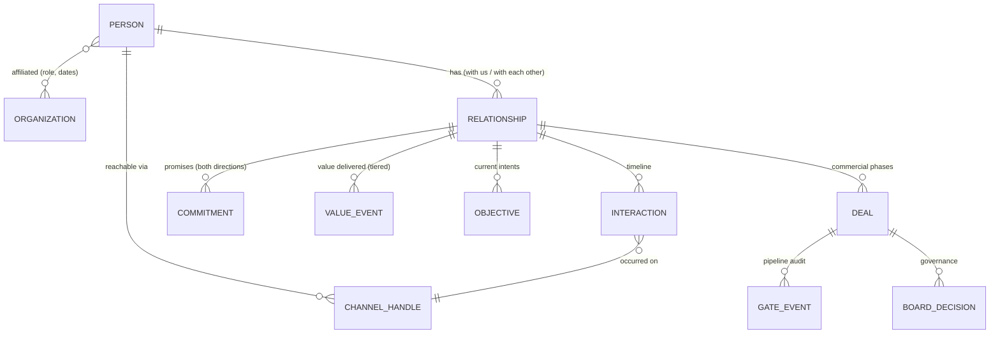
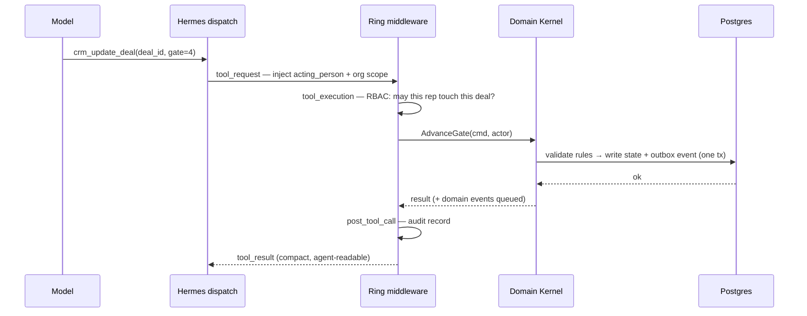
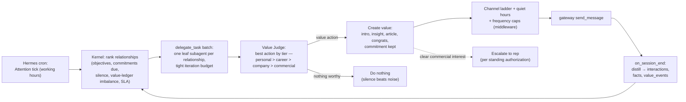

# The Relationship OS — Target Architecture

> **Status:** Architecture design (Milestone 2). Decision recorded: **Hermes is the platform; SalesBrain is a domain application on top of it.** This document designs the end-state we want to still be happy with in 5–10 years — it deliberately does *not* optimize for the easiest migration.
> **Date:** 2026-07-22
> **Basis:** `docs/hermes-platform-evaluation.md` (source-verified analysis of Hermes v0.19.0) + the current SalesBrain codebase.

---

## 1. The organizing principle: mechanism vs. policy

Every durable operating system is built on one rule: **the kernel provides mechanisms; applications provide policy and data.** Linux does not know what a web server is; it knows processes, files, sockets, and timers. That separation is why 30-year-old kernel interfaces still run brand-new applications.

We apply the same rule:

> **Hermes provides every *mechanism* of agency.** Loops, delegation, scheduling triggers, channel transport, memory injection, skill storage, tool dispatch, model providers, sessions, context management.
>
> **SalesBrain provides every *policy* and every *fact* about relationships.** Who people are, what they value, what we promised them, what creates value for them next, which channel to use, what a "deal" or a "board vote" means, who may see what.

This single principle answers most of the questions below mechanically: if a responsibility is generic across any agentic domain, it is Hermes'. If it mentions a person, a relationship, value, or a business rule, it is SalesBrain's. Where the requested split put a *policy* inside the OS (see §3.1), we correct it here — that is the assumption-challenging this document was asked to do.

**The naming follows the principle:** the product is a **Relationship OS** — Hermes is the kernel; SalesBrain is the userland.

---

## 2. The four-layer architecture

```mermaid
flowchart TB
  subgraph L4["LAYER 4 — SURFACES (humans & external systems)"]
    UI["Next.js web app<br/>(read-model + human workflows)"]
    CH["Messaging channels<br/>WhatsApp · Telegram · Email · SMS"]
    EXT["External agents (MCP)<br/>+ zeami.io public API + Calendly"]
  end

  subgraph L3["LAYER 3 — SALESBRAIN DOMAIN KERNEL  (business logic ONLY, zero Hermes imports)"]
    ENT["Relationship Graph:<br/>Person · Organization · Relationship ·<br/>Interaction · Commitment · ValueEvent · Objective · Deal"]
    RULES["Business rules:<br/>gates, board votes, visibility/RBAC,<br/>value rubric, channel ladder, quiet hours"]
    OUTBOX["Transactional outbox<br/>(domain events)"]
    PG[("Postgres<br/>system of record")]
  end

  subgraph L2["LAYER 2 — HERMES ADAPTER RING  (the SalesBrain plugin — adapters ONLY, zero business rules)"]
    TOOLS["crm toolsets<br/>(tools → kernel commands)"]
    MEMA["RelationshipMemory<br/>(MemoryProvider adapter)"]
    MWA["Middleware:<br/>identity, RBAC, value-policy, audit"]
    ROUT["Routines:<br/>Attention Allocator cron + event bridge"]
    SKA["Skills + SOUL content<br/>(playbooks, persona)"]
  end

  subgraph L1["LAYER 1 — HERMES KERNEL  (unmodified upstream, pinned)"]
    LOOP["Agent loop · delegation ·<br/>goal-judge harness · reflection forks"]
    GW["Gateway (channel transport,<br/>api_server, webhook)"]
    CRON["Cron/Chronos triggers"]
    REG["Tool registry · toolsets ·<br/>skills engine · memory machinery"]
    PROV["Provider abstraction<br/>(anthropic_messages)"]
    SESS["Sessions (transport transcripts,<br/>FTS5) · context/compression · prompt cache"]
  end

  UI -->|"kernel HTTP API"| L3
  UI -->|"chat via api_server channel"| GW
  CH <--> GW
  EXT --> L3
  L2 -->|"register(ctx)"| L1
  TOOLS --> ENT
  MEMA --> ENT
  ROUT --> OUTBOX
  RULES --> PG
  ENT --> PG
```



Dependency direction is strict and is the whole maintainability story:

- **Layer 3 (Domain Kernel)** imports nothing from Hermes. It is a pure Python package (`salesbrain-core`) with entities, commands, rules, repositories, and an outbox. It would survive Hermes' death untouched.
- **Layer 2 (Adapter Ring)** is the Hermes plugin — a standalone repo distributed via the `hermes_agent.plugins` pip entry point, exactly as upstream governance demands. It contains *only* adapters: it translates Hermes contracts (tools, `MemoryProvider`, middleware, cron, platform config) into kernel calls. Hermes API churn is absorbed here and nowhere else.
- **Layer 1 (Hermes)** is pinned, unmodified upstream. We never fork.
- **Layer 4** consumes the kernel's HTTP API (UI) or Hermes' gateway (channels). The UI stops being an agent host.

This is hexagonal architecture applied to an agent platform: the kernel has ports; Hermes is one adapter ring around them. If a better runtime exists in 2031, we write a second ring — the business survives.

---

## 3. Responsibility assignment

### 3.1 Corrections to the proposed split (assumptions challenged)

The requested separation put five items wholly in Hermes Core that the source evidence says cannot live there wholly. Each splits along mechanism/policy:

| Proposed as "Hermes Core" | What Hermes actually provides (verified) | What must be SalesBrain's |
|---|---|---|
| **Planning** | A goal-*completion* harness: `GoalContract`/`GoalManager` + a pluggable aux-LLM `judge_goal` returning done/continue. No value ranking, no standing planner. | The **Value Judge** rubric (personal > career > company > commercial) supplied into the judge slot, per-relationship **Objectives** as domain data, and the **Attention Allocator** that decides *which relationship gets agency now*. |
| **Memory** | The *machinery*: `MemoryProvider` ABC, prefetch/injection (`<memory-context>`), nudge→background-review forks, FTS5 session recall. Built-in store is a single-user markdown file — unusable for contacts. | The *content and schema*: the Relationship Graph, per-person models, what is worth remembering about a human. Shipped as our `RelationshipMemory` provider backed by the kernel. |
| **Event Bus** | **Does not exist.** Verified: no pub/sub; all triggers converge on `handle_message`. Hermes has *trigger transports* (webhook adapter, cron, gateway). | Domain events (`interaction.received`, `commitment.due`, `deal.gate_changed`) with **transactional-outbox semantics** — events must commit atomically with state, and only the kernel owns the store. Hermes cannot provide this even in principle. |
| **Reflection** | The *fork mechanism*: every ~10 turns a second agent reviews the transcript and writes MEMORY.md/skills. Generic, disk-targeted. | The **per-interaction learning loop**: "what did I learn about this person, what value can I create next" → written to the Relationship Graph, not to markdown. We redirect the mechanism; we own the question it asks. |
| **Session Management** | Transport transcripts keyed `platform:chat_type:chat_id` — a person on 3 channels is 3 unrelated sessions. | The **Interaction Ledger**: one person-keyed, cross-channel timeline, projected from Hermes sessions via hooks. The relationship timeline is domain data. |

Everything else in the proposed Hermes column stands as-is: runtime, skills engine, scheduling triggers, plugin system, tool registry, provider abstraction, context building.

### 3.2 The full matrix

| Responsibility | Owner | Form |
|---|---|---|
| Conversation loop, streaming, interrupts, budgets | **Hermes** | as-is |
| Subagent delegation (sync/async, leaf/orchestrator) | **Hermes** | as-is |
| Cron/Chronos triggers, webhook ingress | **Hermes** | as-is |
| Channel transport (Telegram, WhatsApp, Email, SMS, api_server) | **Hermes** | as-is + config |
| Tool registry, toolsets, schemas, dispatch | **Hermes** | as-is |
| Skills storage, progressive disclosure, curation | **Hermes** | as-is |
| Memory injection machinery, provider orchestration | **Hermes** | as-is |
| Goal-loop harness + judge slot | **Hermes** | as-is |
| Model providers (Claude via `anthropic_messages`) | **Hermes** | config |
| Context assembly, compression, prompt caching | **Hermes** | as-is |
| Sessions as transport transcripts + FTS5 recall | **Hermes** | as-is |
| People, organizations, relationships, identity resolution | **SalesBrain kernel** | entities + resolver |
| Interaction Ledger (cross-channel person timeline) | **SalesBrain kernel** | projection via hooks |
| Trust Ledger: commitments + value events (tiered) | **SalesBrain kernel** | new entities |
| Objectives + Value Judge rubric | **SalesBrain kernel** (policy) via **ring** (judge config) | new |
| Attention Allocator (who gets agency now) | **SalesBrain kernel** (ranking) via **ring** (cron routine) | new |
| Channel ladder, quiet hours, frequency caps | **SalesBrain kernel** (policy) via **ring** (middleware) | new |
| Deals, gates, pipelines, board votes, pricing, onboarding | **SalesBrain kernel** | ported rules |
| Outreach drafting rules, research playbooks | **SalesBrain** | skills content + tools |
| RBAC / visibility ("user_id = me OR lead_id = me") | **SalesBrain kernel**, enforced at ring | ported rule |
| Audit of every agent action | **SalesBrain kernel** (log) via ring (`post_tool_call`) | replaces `mcp_audit_log` |
| Reporting, dashboards, human workflows | **SalesBrain UI** | Next.js |
| Persona ("who the agent is") | **SalesBrain** | SOUL.md + skills in plugin |

---

## 4. Recentering the domain: the Relationship Graph

The instruction was explicit: *the objective is not to recreate the current CRM on Hermes.* The current schema is **deal-centric** — `conversations`, `gate_events`, `followups`, even memory hang off `deals`. A deal-centric store cannot express "create value before asking for value," because value created *before* any deal exists has nowhere to live.

The 5–10-year model is **person-centric**. The relationship is the root aggregate; a deal is a *commercial phase* that a relationship may enter — and revenue becomes a measured *outcome* of relationship health, exactly as the philosophy demands.



New core entities (additive migrations around the existing tables — not a big-bang rewrite):

| Entity | What it captures | Why it's load-bearing |
|---|---|---|
| **`people` / `channel_handles`** | One human; their Telegram ID, WhatsApp number, email addresses, LinkedIn URL. The **Identity Resolver** maps any inbound handle → `person_id`. | Kills the "3 channels = 3 strangers" problem at the data layer. Every other table keys off `person_id`. |
| **`relationships`** | Our standing with a person: stage on the *relationship* ladder (stranger → acquaintance → trusted → advocate), preferred channel, cadence, owner rep. | The unit the Attention Allocator schedules. Pipeline gates measured deals; this measures trust. |
| **`interactions`** | Every touch, inbound or outbound, any channel, person-keyed. Supersedes deal-scoped `conversations` as the primary log (Hermes keeps raw transcripts; this is the curated domain projection). | The unified timeline the current architecture cannot produce. |
| **`commitments`** | Promises, both directions: "I'll send the intro Friday," "he'll review by Tuesday." State: open → kept → broken. | Kept commitments are the mechanics of trust. Agent never lets one silently lapse — this generalizes today's followups. |
| **`value_events`** | A concrete instance of value delivered, tagged by tier: `personal` / `career` / `company` / `commercial`. | Makes "create value before asking" *measurable and auditable* instead of a vibe. The Value Judge reads the ledger balance before permitting a commercial ask. |
| **`objectives`** | Per-relationship intents with target tier and status; feed the judge and the allocator. | The planner's working set. |
| **`deals`** (existing, evolved) | Gains `relationship_id`. Gates, board votes, pricing, onboarding keep their exact current semantics. | Nothing about the commercial machinery is lost — it is *re-parented*. |

`accounts`/`contacts`/`prospects`/`sales_leads` converge into `organizations`/`people` + relationship stages — four overlapping person-ish tables become one graph.

---

## 5. Anatomy of the SalesBrain plugin (the Adapter Ring)

One standalone repo, `salesbrain-hermes` (pip: `hermes_agent.plugins` entry point), containing **no business rules** — every handler is a thin translation into a kernel command:

```python
# salesbrain-hermes/__init__.py  (shape, not final code)
def register(ctx):
    # 1. Tools — the agent's hands (§6)
    for tool in crm_toolsets.all():          # crm_core, crm_outreach, crm_research, crm_admin
        ctx.register_tool(**tool)

    # 2. Identity + policy — every turn, every tool call (§7)
    ctx.register_middleware("tool_request",  acting_identity.inject)   # who is acting, for whom
    ctx.register_middleware("tool_execution", policy.enforce)          # RBAC, quiet hours, caps, ladder
    ctx.register_hook("post_tool_call",       audit.record)            # kernel audit log
    ctx.register_hook("on_session_end",       learning.distill)        # per-interaction person-learning

    # 3. Memory — the relationship graph as the agent's memory (§3.1)
    #    RelationshipMemory implements MemoryProvider: prefetch(person) → dossier,
    #    sync_turn → interaction + candidate facts. Configured as memory.provider.

    # 4. Surfaces
    ctx.register_cli_command("crm", cli.build)               # hermes crm ...
```

Plus, shipped as plugin assets rather than code:

- **Skills** — the persona's playbooks: qualification checklist, board-summary format, grant money-first discipline, Mateo's follow-up rules (every update names unanswered questions + a dated next step), Searchfunder engagement doctrine. Today these live hardcoded in `lib/agent.ts`'s prompt and `SYSTEM_PROMPT.md`; as skills they become progressively disclosed, versioned, and editable without redeploy.
- **SOUL.md** — the agent identity per profile (relationship-first doctrine stated as character, not rules).
- **Routines** — cron definitions: the Attention Allocator tick, daily digest, commitment-due sweeps, board-vote nudges (replacing all `/api/cron/*` endpoints and their GitHub-Actions triggers).
- **Config** — toolset↔platform matrix, judge routing (`auxiliary.goal_judge.*` → Value Judge rubric), memory provider selection, board-group gateway settings.

**Deployment shape:** one Hermes deployment per organization (profile = org tenant, matching Kanban's board-as-hard-boundary), *not* per rep. Reps are **acting identities** threaded through every call (§7) — they share one Relationship Graph, one skills library, one agent. Per-rep profiles would shatter the graph, duplicate config, and defeat the point.

---

## 6. How tool executors evolve

Today's `lib/tool-executors.ts` + `lib/prospect-executors.ts` + `lib/mcp/tool-definitions.ts` + `lib/mcp/tool-dispatch.ts` maintain **the same tool in up to four places** (schema, executor, MCP dispatch, agent prompt). The evolution collapses each tool to **one registration + one kernel command**, and moves every embedded business rule out of the executor into the kernel:

| Today (TS executor) | Tomorrow (Hermes tool → kernel command) | Business rule extracted to kernel |
|---|---|---|
| `exec_update_deal` | `crm_update_deal` → `AdvanceGate` / `UpdateDealFields` | Gate requirements, grant money-first cross-gate block, board-flag dedup, G9→onboarding hook, superseded-vote sweep |
| `exec_send_telegram` (board) | `crm_request_board_review` → `OpenBoardDecision` (delivery via gateway) | 5-of-8 thresholds, per-gate summary requirements (deployment plan at G7) |
| `exec_send_email` / `send_outreach_message` | `crm_send_outreach` → `RecordOutreach` + Hermes `send_message` | Channel ladder, quiet hours, frequency caps, unsubscribe discipline — *enforced in kernel + middleware, not in the executor* |
| `exec_schedule_followup` | `crm_make_commitment` → `RecordCommitment` | Followups generalize into the commitment ledger |
| `exec_remember` / `exec_forget` | *(retired as tools)* → `RelationshipMemory` provider + `crm_record_fact` | Facts attach to people/relationships, not markdown files |
| `exec_assess_deal`, `prep_meeting`, research/enrich tools | `crm_assess`, `crm_prep_meeting`, `crm_research_company` | Scoring rubrics; web research stays a Hermes-native capability |
| `exec_mark_deal_lost` | `crm_mark_lost` → `CloseDeal` + `RecordLesson` | Lesson taxonomy; lessons also surface via memory prefetch |
| `classify_outreach_reply`, `convert_prospect_to_deal` | inbound handling via identity middleware + `crm_open_deal` | Prospect stages fold into relationship stages |

The anatomy of every evolved tool is identical, and this uniformity is the maintainability win:



The **external MCP server** (`/api/mcp`) survives as a *thin re-exposure of the same kernel commands* for third-party agents (Claude Desktop etc.) — but Hermes itself never uses it: ring tools call the kernel in-process. One rulebook, two doors.

---

## 7. Replacing the current agent runtime

Both bespoke runtimes are **retired, not ported**:

- **`lib/agent.ts` (deal-chat, SSE)** → deleted. The Next.js chat component points at the Hermes **`api_server` gateway platform** — verified to provide exactly the needed contract: `POST /api/sessions/{id}/chat/stream`, session CRUD + fork, SSE lifecycle events, run approvals and interrupts, `API_SERVER_KEY` auth, per-profile multiplexing. The web app becomes *just another channel* — architecturally identical to Telegram. The 5-phase history sanitizer, the `LIMIT 200` loader, and the hand-rolled prompt-cache split — the trickiest, most fragile code in SalesBrain — cease to exist; Hermes owns transcripts, pairing-repair, compression, and caching.
- **`lib/telegram-agent.ts` + the 4-route webhook** → the gateway's Telegram platform plugin. Route mapping: identity linking → gateway DM pairing + our Identity Resolver; free-text DM and group @mention → normal gateway sessions with acting-identity middleware; **board-vote reply parsing → a gateway hook that intercepts *before* the LLM** — votes are deterministic domain commands (`CastVote`), and burning model calls on them would be both wasteful and less reliable. Deterministic-first, agent-fallback: the same split today's Route 2 vs Routes 3/4 already encodes.
- **Acting identity** (the abstraction that replaces per-surface auth): every entry point resolves to `(acting_user, person_in_conversation, org)` — web session via the api_server key exchange, Telegram via link table, cron routines run as the org's agent principal. Middleware injects it into every tool call; the kernel enforces the exact visibility rule that exists today. RBAC lives in **one** place instead of per-surface reimplementations.

**Proactivity — the loop that makes it an OS, not a chatbot:**



Every box composes verified Hermes primitives (cron `script` injection, batch delegation, judge slot, middleware, `send_message`) with kernel policy. Domain events flow the other way through the **outbox → trigger bridge**: a kernel event (`commitment.due`, `deal.gate_changed`, Calendly booking) arms a Hermes one-shot cron or webhook call — giving us the event-driven triggers Hermes lacks natively, with transactional integrity Hermes could never guarantee.

---

## 8. What stays, what migrates, what dies

**Unchanged (role sharpened):** Postgres (additive evolution to the graph schema); the Next.js app as read-model + human workflows (pipeline, reports, onboarding kanban, approvals, settings) calling the kernel API; the pricing engine (SheetJS+HyperFormula stays a bounded TS service behind a kernel port — porting a working Excel evaluator to Python is risk without reward); the zeami.io public API and Calendly webhook (now writing through the kernel, emitting outbox events); board-vote *semantics*.

**Migrated into the platform:** both agent loops; all tool executors (§6); all cron endpoints + their GitHub-Actions triggers → Hermes routines; `memory/org.md` + `memory/users/*.md` → RelationshipMemory + skills; `SYSTEM_PROMPT.md` + prompt constants → SOUL.md + skills; Telegram surface → gateway; `mcp_audit_log` → kernel audit via `post_tool_call`.

**Dies with honor:** the 5-phase history sanitizer; the four-place tool definition duplication; `lib/llm.ts` (model choice becomes `hermes model`); the fire-and-forget notification pattern (gateway owns delivery + retry); GitHub-Actions-as-scheduler.

---

## 9. Long-term maintainability commitments

1. **The two-repo rule.** `salesbrain-core` (kernel: entities, commands, rules, migrations, HTTP API) and `salesbrain-hermes` (ring: adapters only). A rule that cannot be unit-tested without Hermes running is in the wrong repo — this is the enforceable meaning of "SalesBrain contains business logic only."
2. **The ring is the only Hermes-aware code**, and it touches only documented contracts (`register(ctx)`, `MemoryProvider`, middleware kinds, cron tool, platform config, api_server HTTP). Contract tests pin each seam; a Hermes upgrade is: bump pin → run ring contract tests → fix adapters. Kernel untouched.
3. **Never fork; contribute narrow seams.** Upstream candidates where our needs are genuinely generic: a participant-identity hook on gateway events; a first-class judge-interface for goal evaluation; delivery-confirmation callbacks. Domain logic never goes upstream — governance would reject it, and it's our moat.
4. **One rulebook.** Business rules exist once, in kernel commands — the agent, the UI, and external MCP clients all pass through them. The current TS/agent-prompt rule duplication (gate logic in `gates.ts` *and* the system prompt *and* tool-dispatch guards) ends.
5. **Autonomy is governed, not vibes.** The Curator and generic memory nudges are disabled for org profiles; learning flows through the kernel's per-interaction hook. Every autonomous send passes policy middleware (quiet hours, caps, ladder) and lands in the audit log. Standing authorizations (e.g., Searchfunder low-value autonomy, escalate on commercial interest) are kernel policy records — inspectable, versioned, revocable.
6. **Exit is designed in.** MIT license + pinned source + a kernel with zero Hermes imports means the worst-case (Hermes abandoned in 2029) costs one adapter ring rewrite, not the business.

### Honest weaknesses of this design

- **Two languages.** Kernel in Python (in-process with the ring), UI in TS. Mitigated by the one-rulebook rule (TS never re-implements rules; it calls the API) — but it is a real tax, and the team must hold the line.
- **Hermes plugin/middleware API stability is undocumented.** The ring + contract tests are the containment; expect adapter churn on upgrades.
- **Single-host agent runtime** (SQLite). Fine for an org-sized fleet; multi-org SaaS means profile-per-org and operational discipline. The domain scales in Postgres regardless.
- **LLM economics of proactivity.** Attention ticks + judges + delegation multiply calls. Budgets are first-class (iteration budgets, per-relationship caps, allocator top-N) from day one, not retrofitted.
- **The graph migration is the hard part** — deal-scoped conversations must be re-keyed to people. Additive tables + backfill mapping, run as its own workstream.

---

## 10. Definition of "first-class"

SalesBrain is a first-class Hermes application — not an app that merely uses Hermes — when all of these are true:

- [ ] `pip install salesbrain-hermes` + `hermes plugins enable salesbrain` is the entire agent-side install.
- [ ] Zero agent loops, prompt builders, or history loaders exist in the Next.js codebase.
- [ ] Every agent capability is a registered tool/skill/routine visible to `hermes tools` / `/skills`.
- [ ] The web chat is a gateway channel (api_server), peer to Telegram and WhatsApp.
- [ ] The agent's memory of any person is the Relationship Graph, via `MemoryProvider` — no markdown person-files.
- [ ] Every autonomous action is attributable: acting identity + policy decision + audit row.
- [ ] The kernel test suite passes with Hermes not installed.
- [ ] A Hermes version bump touches only the ring.
- [ ] The Value Judge can explain, for any outbound message, which tier of value it served — and the value ledger shows credit extended before any commercial ask.

---

*Milestone 2 deliverable. Next: green-light the PoCs from the evaluation report (§13) re-scoped to this design — PoC-A becomes the ring skeleton + one kernel command; PoC-B becomes Identity Resolver + RelationshipMemory dossier; PoC-C the Value Judge rubric in the judge slot.*
